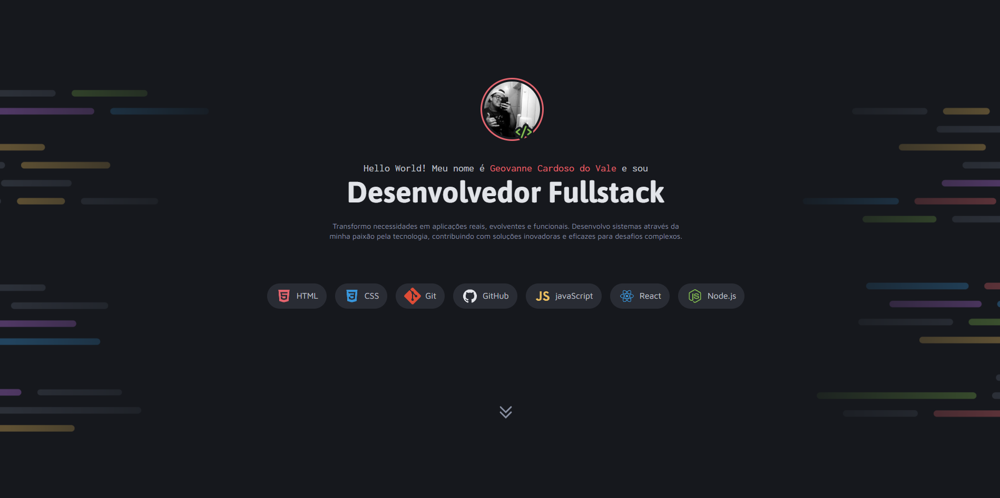

Desafio proposto no curso full-stack da rockeat!

Realizei a criacao de uma pagina para portifolio.

Utilizando todo conhecimento que adquiri durante o curso.

-HTML(Semantico e nao semantico);
-CSS (Flexbox e Grid);